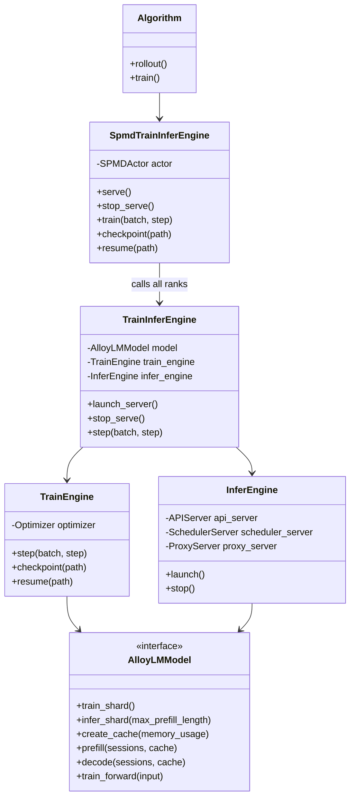
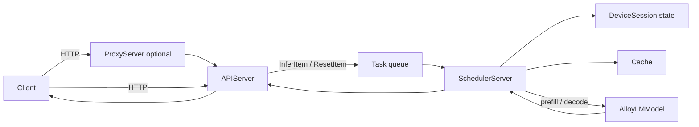

# Engine architecture

The engine package provides the shared model contract, distributed execution,
inference serving, and RL training runtime used by `alloylm`.

## Components

- `model.py` defines `AlloyLMModel`, `Cache`, `DeviceSession`, and the
  training input contract. Model implementations provide training and
  inference sharding, cache creation, prefill, decode, and training forward
  methods.
- `infer_engine/` provides the OpenAI-compatible API, continuous-batching
  scheduler, sampling, cache/session management, and optional multi-worker
  proxy.
- `train_engine/` packs RL samples, computes the policy loss, updates the
  model, and manages optimizer state and distributed checkpoints.
- `train_engine/train_infer_engine.py` coordinates one model between training
  and inference without maintaining separate model copies.
- `spmd.py` launches the same engine implementation on a Ray actor group and
  forwards method calls to every rank.

## High-level design



## Inference flow



`APIServer` tokenizes requests and translates them into scheduler items. The
scheduler owns the prefill and decode queues, groups compatible sessions into
batches, allocates cache entries, and repeatedly calls the model until each
request reaches a stop condition. `DeviceSession` retains token, log-probability,
and entropy state for interactive requests.

`ProxyServer` is created only when multiple inference workers need a shared
endpoint. It registers workers by model name and routes requests to the
least-busy worker.

## Training and inference lifecycle

`TrainInferEngine` shares one `AlloyLMModel` between both execution paths:

1. `launch_server()` offloads optimizer state, gathers the model for inference,
   and launches the scheduler and API server.
2. The algorithm generates rollouts through the HTTP endpoint.
3. `stop_serve()` aborts serving, restores the training sharding, and activates
   the optimizer.
4. `step()` passes the rollout batch to `TrainEngine`, which packs samples,
   computes the configured policy loss, and updates the model.

The algorithm-to-trainer boundary uses `RLInput`:

```python
class RLInput(TypedDict, total=False):
    input_ids: list[int]
    labels: list[int]
    inference_logprobs: list[float]
    advantages: float
```

Engine-internal metadata such as sample IDs and token counts is added after
this boundary.

## Model implementation contract

A model implementation must:

- Load and save model weights.
- Define the training and inference device meshes.
- Switch between training and inference sharding.
- Create a cache compatible with its attention implementation.
- Implement batched `prefill()` and `decode()` using `DeviceSession`.
- Implement `train_forward()` and return hidden states consumed by the
  training loss.

See `alloylm/impl/engines/qwen/` for the current implementation.

